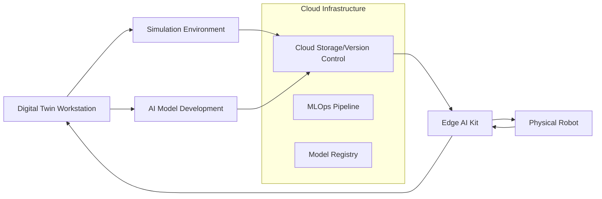

# High-Level Infrastructure Architecture

This section provides a comprehensive overview of the technical architecture and procurement strategy for building a Physical AI and Humanoid Robotics laboratory. The architecture is designed around three core infrastructure components that work together to provide a complete educational and research platform.

## Core Infrastructure Components

### 1. Digital Twin Workstation (RTX GPU)

The **Digital Twin Workstation** serves as the primary development and simulation environment for students and researchers.

**Technical Specifications:**
- **GPU**: NVIDIA RTX 4090 or RTX A6000 (24GB+ VRAM)
- **CPU**: Intel Core i9-13900K or AMD Ryzen 9 7950X
- **RAM**: 64GB DDR5 ECC RAM
- **Storage**: 2TB NVMe SSD + 4TB secondary storage
- **OS**: Ubuntu 22.04 LTS with Windows 11 dual boot

**Purpose and Functionality:**
- **High-Fidelity Simulation**: Run NVIDIA Isaac Sim, Gazebo, and custom physics engines
- **AI Model Development**: Train and test Vision-Language-Action (VLA) models
- **Digital Twin Creation**: Develop accurate virtual replicas of physical robots
- **Real-Time Rendering**: Visualize complex robotics scenarios with photorealistic graphics

**Software Stack:**
- ROS 2 Humble
- NVIDIA Isaac Sim 4.0+
- Gazebo Classic + Ignition Gazebo
- PyTorch/TensorFlow with CUDA support
- Docker and NVIDIA Container Toolkit

### 2. Edge AI Kit (Jetson Orin)

The **Edge AI Kit** provides on-robot processing capabilities for real-time AI inference and control.

**Technical Specifications:**
- **Compute Module**: NVIDIA Jetson AGX Orin 64GB
- **AI Performance**: 275 INT8 TOPS, 64 TFLOPS FP16
- **Power**: 15-60W configurable power modes
- **Connectivity**: 10Gb Ethernet, USB 3.2, M.2 NVMe support
- **Operating Temperature**: 0°C to 50°C

**Purpose and Functionality:**
- **Real-Time Control**: Execute low-latency control loops for humanoid robots
- **Edge AI Inference**: Run compressed VLA models directly on the robot
- **Sensor Processing**: Process camera, LiDAR, and IMU data in real-time
- **Connectivity**: Bridge between robot hardware and cloud infrastructure

**Integration Capabilities:**
- CAN bus and EtherCAT interfaces for motor control
- MIPI CSI-2 camera interfaces
- UART, I2C, SPI for sensor integration
- NVIDIA JetPack SDK with ROS 2 support

### 3. Robot Lab (Unitree Options)

The **Robot Lab** component consists of physical humanoid robots that serve as the primary learning and research platform.

**Recommended Options:**

#### Unitree H1 (Premium Option)
- **Height**: 180cm
- **Weight**: 47kg
- **Degrees of Freedom**: 19
- **Max Speed**: 3.3 m/s
- **Battery Life**: 2 hours
- **Price**: ~$150,000

#### Unitree G1 (Educational Option)
- **Height**: 132cm
- **Weight**: 35kg
- **Degrees of Freedom**: 23
- **Max Speed**: 2.0 m/s
- **Battery Life**: 2 hours
- **Price**: ~$90,000

**Core Capabilities:**
- **Humanoid Locomotion**: Walking, running, stair climbing
- **Manipulation**: Dual-arm manipulation with 5-DOF grippers
- **Perception**: Integrated depth cameras and 3D LiDAR
- **Interaction**: Voice interaction and visual display

## Integration Architecture

### Data Flow and Communication

### Network Topology

**High-Speed Network Requirements:**
- **Campus Backbone**: 10GbE fiber connection
- **Lab Network**: 1GbE with QoS for real-time control
- **Wireless**: Wi-Fi 6E for mobile robot communication
- **5G Ready**: Optional cellular connectivity for field operations

### Sim-to-Real Transfer Pipeline

The architecture enables seamless transfer from simulation to physical robots:

1. **Development Phase**
   - Algorithm development in Digital Twin Workstation
   - Testing in high-fidelity simulation environments
   - Model optimization and compression

2. **Deployment Phase**
   - Model transfer to Edge AI Kit via network
   - Real-world testing with safety protocols
   - Performance monitoring and iteration

## Procurement Strategy

### Budget Allocation (Typical University Lab - 20 Students)

| Component | Quantity | Unit Cost | Total Cost | Notes |
|-----------|----------|-----------|------------|-------|
| Digital Twin Workstations | 10 | $8,000 | $80,000 | RTX 4090 systems |
| Edge AI Kits | 20 | $2,000 | $40,000 | Jetson AGX Orin |
| Humanoid Robots | 4 | $90,000 | $360,000 | Unitree G1 educational package |
| Network Infrastructure | 1 | $25,000 | $25,000 | Switches, routers, cabling |
| Safety Equipment | 1 | $15,000 | $15,000 | Emergency stops, barriers |
| **Total** | - | - | **$520,000** | **Complete lab setup** |

### Phased Implementation Approach

**Phase 1: Foundation (Months 1-3)**
- Network infrastructure setup
- 2 Digital Twin Workstations
- 4 Edge AI Kits
- 1 Humanoid Robot

**Phase 2: Expansion (Months 4-6)**
- Additional workstations (total 6)
- Complete Edge AI Kit deployment
- 2 additional robots

**Phase 3: Full Capacity (Months 7-12)**
- Complete workstation deployment
- Final robot procurement
- Advanced AI infrastructure

## Technical Benefits

### Educational Advantages

1. **Progressive Learning Path**: Students advance from simulation to physical robots
2. **Safe Environment**: Extensive simulation experience before hardware interaction
3. **Scalable Platform**: Supports individual and team-based projects
4. **Industry-Relevant Skills**: Experience with cutting-edge robotics platforms

### Research Capabilities

1. **Advanced AI Research**: VLA model development and testing
2. **Humanoid Locomotion**: Cutting-edge bipedal robotics research
3. **Human-Robot Interaction**: Natural language interfaces and autonomous behavior
4. **Cross-Disciplinary**: Computer vision, machine learning, control systems

### Infrastructure Benefits

1. **Future-Proof**: Modular design allows for easy upgrades
2. **Cost-Effective**: Shared simulation resources reduce hardware requirements
3. **Scalable**: Architecture supports growing student populations
4. **Industry Collaboration**: Platform compatible with industry standards

## Security and Safety Considerations

### Physical Safety

- **Emergency Stop Systems**: Physical and software-based emergency stops
- **Safety Barriers**: Physical enclosures for robot testing areas
- **Power Management**: Redundant power systems and backup generators
- **Access Control**: Restricted access to high-voltage equipment

### Cybersecurity

- **Network Segmentation**: Isolated networks for robot control and development
- **Access Management**: Role-based access control for different user levels
- **Data Protection**: Encrypted storage for research data and models
- **Monitoring**: Real-time monitoring of system status and security events

## Success Metrics

### Technical KPIs

- **Simulation Fidelity**: <5% sim-to-real performance gap
- **System Uptime**: >95% availability during class hours
- **Latency**: <10ms end-to-end control loop latency
- **Throughput**: Support for 20 concurrent users

### Educational Outcomes

- **Student Engagement**: >90% satisfaction with hands-on experience
- **Skill Development**: Measured competency in ROS 2, AI, and robotics
- **Research Output**: Publications and presentations stemming from lab work
- **Industry Placement**: Student success in robotics industry careers

---

This architecture provides a comprehensive foundation for building a world-class Physical AI and Humanoid Robotics laboratory. The modular design ensures scalability and adaptability to evolving technological requirements while maintaining a focus on educational effectiveness and research excellence.